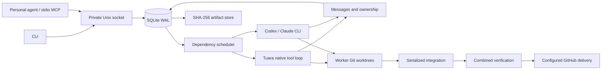

# Architecture

One local daemon owns scheduling. CLI and MCP clients connect over a private Unix socket using one newline-delimited JSON request per connection. The stdio MCP bridge supports initialization, tool discovery, and tool calls; it writes protocol messages only to stdout. Disconnecting a client does not cancel tasks.

## Durability

SQLite uses WAL, foreign keys, FULL synchronous mode, and immediate write transactions for coordination mutations. Hordes pin their objective, repository, merged settings, and expanded plan. Revisions retain prior plans. Every invocation creates an attempt with identity, timestamps, PID when executing a command, result, and provider-reported usage.

Before additive migrations, Horde recognizes the historical schema 2 layout with
`outcomes` as workflows and `tasks` as steps. With the daemon stopped, it saves a
private SQLite backup, then transactionally renames tables and references to the
current layout. Unfinished workflows become blocked so pinned provider settings
and historical work cannot replay automatically. Incomplete outcome trees,
federation records, or conflicting populated replacement tables prevent migration
and leave the records untouched. See [installation](installing.md#recovering-an-older-database)
for recovery when the installed updater cannot open this layout.

Messages and recipient receipts commit together before returning a sender acknowledgement. Message identity is immutable: reusing an ID with a different envelope fails. Delivery is at-least-once until explicit recipient acknowledgement. Acknowledgement cursors stop before the first unread message. A separate notification watermark prevents repeated model calls for an already-delivered wakeup.

Native file writes and patches check exclusive claims. An atomic prefix handoff also transfers nested claims. Worker status updates and messages cannot implicitly release ownership. Failed and uncertain attempts preserve claims. Workspace and branch registrations are unique. Worktree allocation can recover a worktree created before its registration reached SQLite.

Artifact bytes are addressed by SHA-256, synced before the database reference commits, and checked on retrieval. Each link records inputs and verification status. Knowledge has its own provenance and relationship tables. Execution state is never inferred from a knowledge claim or conversation.

## Scheduling and recovery

A step becomes eligible after its dependencies reach terminal states and its condition is satisfied. Unhandled failed dependencies skip downstream work. Retry counts are bounded. Explicit failure branches can repair a failure and lead to another verification step. Role fallbacks are opt-in, cycle-checked TOML mappings and are recorded as escalation events.

The daemon applies its user-level concurrency ceiling across tasks; a project's concurrency setting can further restrict its own task. Claims prevent overlapping coding steps from dispatching. Verification and delivery commands run exclusively against the combined workspace. Git integration is serialized with a per-task file lock and a durable queue record. There is no distributed lease service.

A hard restart marks running attempts uncertain and blocks their tasks. It never assumes an interrupted process, model call, merge, or external write did nothing. Reconciliation checks recorded PIDs, preserves claims, and requires inspection of local/external effects. A subsequent delivery attempt queries PR/merge/deployment state before retrying. Graceful SIGINT/SIGTERM and cancellation stop command process groups.

An actionable message delivered to an idle managed worker schedules a new step revision using the same worker identity. Messages arriving during an invocation remain durable and can trigger a follow-up if still actionable and unread when that invocation finishes. Presence and acknowledgement updates never invoke a model.

## Delegation, questions, and app lifetimes

Schema version 2 adds task trees, immutable context sources, attempt context
pins, question routes, event receipts, named bundle bindings, app ownership,
remote links, and child acceptance. Existing tasks retain their original
objective during the additive migration. Nested atomic operations use SQLite
savepoints; sender receipts, child identities, and assignment hashes commit
before acknowledgement.

Every child sees the original contract and source IDs. Mandatory context is
bounded to 256 KiB; supporting sources are paged, with provenance retained.
Caller corrections append a new source and can supersede old constraints without
deleting them. Answers preserve the exact question envelope and advance the
family context version. Results pinned to older versions fail acceptance.

A question blocks its assigned worker, leaving independent branches eligible.
The immediate caller answers within its scope or escalates one level. Escalation
commentary is separate from the question. Human-only answers require an external
caller attestation. Native workers receive pending questions at tool boundaries;
harnesses use the same MCP operations and invocation context.

Remote acceptance is deduplicated by owner identity and assignment hash. A lost
response retries the pinned manifest; changed assignments with the same ID fail.
Remote calls reserve one root worker slot. Deeper delegation remains counted at
the original root. Children return snapshots; `integrate_child` imports them
relative to the recorded base and runs explicit combined validation through the
existing integration queue. Conflicts and failed checks never count as acceptance.

Named app bundles store only names and version hashes in SQLite. Local private
files supply values; approved mTLS peers receive private temporary copies.
Copies are removed after completion and on restart, and fetched again for active
work. App logs and command evidence redact selected literal values before
persistence. Provider authentication stays in the existing credential broker.

Managed process and Compose steps persist resource intent before starting. Each
has a bounded lifetime, readiness check, test command, and cleanup record. App and
test process groups carry a recorded process identity. Startup stops matching
owned groups, tears down the uniquely named Compose project, and removes owned
env files. Identity mismatch holds cleanup for inspection. Uncertain step effects
still require reconciliation; cleanup does not assert that interrupted tests did
nothing. Unreachable remote runtimes keep root reservations until reconciled.

## Pinned worker skills

Schema version 3 adds task-owned skill bindings and per-attempt skill records. Submission
captures explicitly configured skill directories into the existing artifact store.
Workflow steps select names from that pinned catalog. The shared invocation prompt
exposes selected names, hashes, and resource locations; `read_skill` serves pinned
instructions and resources progressively in bounded pages.
Materialized bundles live outside Git worktrees and preserve executable flags.
No script runs as a consequence of loading a skill.

Delegation inherits the captured catalog or an explicit subset. Remote assignment
packets include the exact bundles, covered by assignment deduplication and verified
on receipt. A receiving runtime never resolves sender-local skill paths. Resource
reads verify stored hashes and materialized bytes. Task and attempt bindings remain
authoritative across restart; source-directory edits only affect new submissions.
See [runtime skills](runtime-skills.md) for usage and limits.

## Trust and authority

Optional direct and Tailscale providers share tonic/rustls mutual TLS, with
explicit client certificate enrollment. A separate listener exposes health and
restricted runtime federation RPCs. User-owned execution grants and bundle grants
are separate from certificate enrollment; project files cannot expand them.
Each runtime owns its SQLite store. The original root owns the delegation tree,
context version, worker reservations, environment leases, and child acceptance.
Remote callers forward further delegation to that authority. Committed Git
snapshots and artifact hashes cross the transport; no SQLite files are shared.
See [networking](networking.md) for setup and the protocol boundary.

This is a cooperative, single-user runtime, not a hostile-code sandbox. The data directory is mode 0700 and the socket is mode 0600. A personal-agent connection has administrative authority. Worker tokens limit operations and identity at the RPC layer; they do not isolate programs that can read the same user's filesystem. Never treat a worker token as protection against a malicious local process with that user's full account access.

Provider credentials are read by the daemon. Child commands receive an explicit environment allowlist, omitting API keys. Subscription harness authentication uses the installed CLI's credential store. API-backed harnesses use an invocation-scoped loopback broker that injects the real provider key upstream, restricts paths and configured models, and revokes its temporary token at invocation completion. Native arbitrary commands and external harness edits cannot be completely enforced before execution; their changes are inspected before integration. For stronger isolation, run the service under a dedicated OS account or inside an externally managed sandbox.

The native loop offers file reads, search, full-file writes, unified patches, command execution, and coordination. File tools reject path traversal and symlink traversal. The external Codex adapter uses workspace-write sandboxing and preapproves only the supplied coordination MCP server. Claude receives explicit allowed tools and its scoped MCP configuration. The runtime does not disable the harnesses' managed restrictions.

## Source map

- `store.rs`: persistence, mailboxes, claims, artifacts, step completion.
- `protocol.rs`: shared operation handlers, worker scope checks, MCP schemas.
- `runtime.rs`: scheduler, context assembly, questions, retries, wakeups, daemon.
- `skills.rs`: pinned instruction bundles, selection metadata, progressive resource reads and transfer.
- `executor.rs` / `native.rs`: harness adapters, Tuara loop and probe, process lifecycle, tools.
- `git.rs`: worktrees, scope inspection, integration evidence.
- `template.rs`: composition, pinning, output references and contracts.
- `delivery.rs`: GitHub/Actions/health reconciliation.
- `metrics.rs`: reported usage, costs, latency and coordination counts.

- `delegation.rs`: root limits, context sources, questions, caller receipts.
- `secrets.rs` / `environment.rs`: app bundle inheritance, redaction, owned lifecycles.
- `network.rs` / `federation.rs`: discovery, mTLS identity, snapshot exchange and caller forwarding.

## Runtime management and distribution

Authenticated heartbeats advertise bounded capability records without credentials.
The controller combines those reports with local inventory for parent planning.
Reports retain freshness and separate credential presence from verified access.
Conversational role pools resolve to explicit runtime/capability pairs; the parent
chooses each task's executor. Immutable execution policies bind those pairs to
provider/model identities and can only narrow through delegation. Receiving
workers validate their local bindings and apply a task-specific settings copy.

Orchestration skill files are discovered from the installed pack alongside
configured instructions. Optional per-skill metadata controls default selection;
no skill names or instruction bodies are compiled into the runtime. Immutable
runtime-local packs activate through an atomic pointer for future submissions.
Authenticated skill update requests capture and retain a complete pack for safe
retry, independently of signed binary updates. Both update paths support generic
fleet members as well as provider-managed runtimes.

Shipped orchestration skills are captured alongside configured instructions.
Accepted project overrides are stored independently from the shipped baseline;
proposals use revision/hash checks before activation. Task snapshots and remote
packets retain the exact skill content they started with. A skill cannot expand
runtime execution grants, provider access, or delivery authorization.

Schema version 4 records execution policies, submission receipts, and project
skill revisions. The version advances only after all additive migrations finish;
reopening never lowers it. Older runtimes reject this database instead of running
tasks without their saved execution constraints. Release manifests accept upgrades
from schema 2 and advertise schema 5 support.

Administrative runtime settings, capacity snapshots, enrollment fingerprints,
management receipts, provider resources, and operation intents are stored separately
from worker conversation. A user-owned concurrency override applies live to each
runtime; repository settings cannot raise the daemon ceiling. Capacity selection
uses explicit fallback roles before dispatch and leaves uncertain attempts under
normal recovery rules.

A configured daemon supervises networking and provider maintenance independently
of scheduling. Managed remotes use an outbound mTLS bidirectional control stream.
Provisioning issues unique certificates through an explicitly configured dedicated
CA signer; short-lived bootstrap tokens are consumed on enrollment. The signer
never leaves the controller. The stream carries transport correlations; durable
workflow and management IDs remain authoritative across reconnects.

Signed updates drain active work, preserve storage, and verify the resulting
version before resuming. The release key is embedded by CI. Management APIs are
excluded from worker-token scope and remote management grants are independent
of execution grants. See [runtime management](runtime-management.md) and
[installation](installing.md) for operational boundaries and configuration.

User-directed Tailscale setup creates controller trust in its private data directory.
Pairing discovers candidates through the local Tailscale client, bootstraps only
the selected non-root host over Tailscale SSH, and confirms readiness through the
existing mTLS enrollment and heartbeat path. Exact private bootstrap packets and
receiver intents are retained for retry recovery; SQLite retains only enrollment
hashes and authoritative state. Discovery never creates execution grants.

Named remote submissions retain a root task on the controller and attach the
existing durable remote-link state to that task. Its plan is pinned for remote
execution; the controller scheduler excludes every task with a remote link, even
after a status change or restart. Root authorization is resolved before dispatch.
Remote completion records execution status and an unverified result snapshot.
Explicit result retrieval creates a separate checkout with recorded snapshot
identity; it does not integrate changes into the caller's repository.

Runtime names are presentation metadata. Controller-assigned aliases take
precedence over names reported on authenticated control connections. Name
resolution returns a stable runtime ID and rejects ambiguity. Forgetting a stale
runtime retains revocation and audit records, and never invokes provider deletion.

Universal fleet enrollment uses a separate server-authenticated TLS listener.
Fleet credentials carry controller trust and authorize admission only. The
controller stores credential hashes, limits, and membership in SQLite. Workers
persist a local private key and signed request before attempting registration;
admission deduplicates that public key and checks quota in an immediate transaction.
Certificate subjects and usages are assigned by the controller, never accepted
from the requested extensions. Independently enrolled members do not become
provider-owned resources in `managed_runtimes`.

The existing runtime listener still requires mTLS. Fleet workers receive
client-authentication certificates valid for 24 hours and renew after 12 hours
using their existing identity. Previously issued certificates remain valid
until expiry so a lost renewal reply can be recovered. Revoking a member denies
both certificate generations and disconnects its control stream. Revoking an
admission credential only prevents new members. Worker state is committed before
installing generation-specific certificate paths and replacing network config;
startup replays that installation without requesting a new identity. After
certificate expiry, a member can reassert its still-valid admission credential
and prove possession of the same private key through a signed request. Readmission
retains its runtime identity and quota slot; revoked members cannot use this path.
Workers retain a file reference when credentials come from a file, and otherwise
read the injected credential again. Admission secrets remain outside worker state.

Update handoff intent lives in authoritative runtime settings, separate from
worker conversation. Before switching a running binary, the updater records the
expected executable file identity, version, and management operation. After recovery,
the replacement daemon atomically checks this identity, clears the drain hold,
and completes the operation. A mismatch blocks completion; startup cannot replay
a completed or cancelled handoff. This survives service managers terminating the
original updater with the old daemon.

## Task-family notebook storage

Schema 5 follows the execution-policy migration in schema 4. It keeps the original knowledge rows and adds visibility, conditions,
provenance attribution, lifecycle metadata, idempotent write receipts, and an FTS5
index. Existing rows retain task scope. Claims never update the task-tree version
or scheduling state. New claims are pulled through notebook tools rather than
copied into inherited context.

The existing remote caller route sends notebook operations to the original owning
runtime, which checks authenticated task ownership before resolving family visibility.
Scoped reads have bounded pages and revision-bound cursors; index changes require
restarting pagination. Relationship pages filter out inaccessible targets. Consumers
own durable exports beyond the task family.
