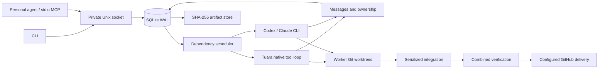

# Architecture

One local daemon owns scheduling. CLI and MCP clients connect over a private Unix socket using one newline-delimited JSON request per connection. The stdio MCP bridge supports initialization, tool discovery, and tool calls; it writes protocol messages only to stdout. Disconnecting a client does not cancel tasks.

```mermaid
flowchart LR
  CLI[CLI] --> RPC[Private Unix socket]
  MCP[Personal agent / stdio MCP] --> RPC
  RPC --> DB[(SQLite WAL)]
  DB --> Scheduler[Dependency scheduler]
  Scheduler --> Native[Tuara native tool loop]
  Scheduler --> Harness[Codex / Claude CLI]
  Native --> Coordination[Messages and ownership]
  Harness --> Coordination
  Coordination --> DB
  Native --> Worktrees[Worker Git worktrees]
  Harness --> Worktrees
  Worktrees --> Integration[Serialized integration]
  Integration --> Checks[Combined verification]
  Checks --> Delivery[Configured GitHub delivery]
  DB --> CAS[SHA-256 artifact store]
```

## Durability

SQLite uses WAL, foreign keys, FULL synchronous mode, and immediate write transactions for coordination mutations. Hordes pin their objective, repository, merged settings, and expanded plan. Revisions retain prior plans. Every invocation creates an attempt with identity, timestamps, PID when executing a command, result, and provider-reported usage.

Before additive migrations, Horde recognizes the historical schema 2 layout with
`outcomes` as workflows and `tasks` as steps. With the daemon stopped, it saves a
private SQLite backup, then transactionally renames tables and references to the
current layout. Unfinished workflows become blocked so pinned provider settings
and historical work cannot replay automatically. Incomplete outcome trees,
federation records, or conflicting populated replacement tables prevent migration
and leave the records untouched. See [installation](installing.md#recovering-an-older-database)
for recovery when the installed updater cannot open this layout.

Messages and recipient receipts commit together before returning a sender acknowledgement. Message identity is immutable: reusing an ID with a different envelope fails. Delivery is at-least-once until explicit recipient acknowledgement. Acknowledgement cursors stop before the first unread message. A separate notification watermark prevents repeated model calls for an already-delivered wakeup.

Each message also pins whether it may wake an idle worker. A task-wide broadcast
from an automatically generated follow-up remains in recipient mailboxes but
cannot schedule another follow-up generation. Direct worker messages and operator
feedback remain wakeable. Existing messages retain their prior wake behavior
when a store upgrades to schema 9.

Native file writes and patches check exclusive claims. An atomic prefix handoff also transfers nested claims. Worker status updates and messages cannot implicitly release ownership. Failed and uncertain attempts preserve claims. Workspace and branch registrations are unique. New integrated worktrees use the configured remote base, fetched before allocation; without a configured base, remote-tip and local-HEAD fallbacks record warnings. The operator checkout is left untouched. A per-task lock covers allocation and atomic start/event recording. Recovery preserves surviving task branches and repairs missing provenance with an explicit recovered source; a missing recorded worktree and branch requires reconciliation.

Artifact bytes are addressed by SHA-256, synced before the database reference commits, and checked on retrieval. Each link records inputs and verification status. Knowledge has its own provenance and relationship tables. Execution state is never inferred from a knowledge claim or conversation.

## Branch-based Runs

Each local Run keeps the existing `refs/heads/horde/<task-id>` branch and integrated worktree. Submission can bind a Thread and Brief to the Run; Horde records those IDs with the project and its operator-owned tenant binding. The task summary reports the branch, current commit, and latest verified checkpoint even after task execution ends.

`run_reconcile` fetches that exact remote ref while holding the integration lock. Horde also reconciles before merging a worker commit, so combined validation covers accepted external edits. Reconciliation fast-forwards the integrated worktree when an authorized external push extends its history, and it rejects divergence, a dirty worktree, or a rewrite of a previously observed remote head. A rejected branch records `run.branch_conflict` with both heads and appears in `summary.run.reconciliation` as `repair_required`. An authorized person can restore the observed remote history or merge the local and remote heads on the remote Run branch, then reconcile again; success clears the repair state without rewriting the local branch. The Git host must also prohibit force pushes for the branch; Horde cannot authenticate a Git pusher or prevent an unseen rewrite at the host.

`run_checkpoint` executes a validation command against an exact expected commit and records a durable validation ID. A configured `HORDE_RUN_ATTESTATION_KEY` signs the project, tenant, Thread, Brief, branch, commit, validation ID, and passed command with HMAC-SHA256; signing requires both Thread and Brief IDs. The key is a base64-encoded 32-byte secret shared with the trusted release verifier. `run_publish` pushes only a currently verified commit with Git's ordinary non-force push. `run_events` pages through versioned Run events with authoritative project and tenant identity and stable event IDs. These operations do not require a PR; templates that include the older delivery step retain their existing GitHub behavior.

### Local branch-first delivery

`run_integrate_main` fetches the exact release base and merges it into the durable
Run branch under the integration lock. Both the Run head and `main` head are
explicit expectations. A conflict aborts the merge and records repair evidence,
leaving the previous branch checkpoint intact. No push or artifact build occurs.

Checkpoints always report `tree_sha`. Supplying `expected_main_head` additionally
requires that base to be an ancestor of the Run and still be the remote base before
and after validation. Optional paired `artifact_digest` and `build_id` bind an
already-built artifact to the signed checkpoint; this requires the expected base.
Horde validates identity and checks, while Release verifies publication/provenance,
constructs the new main merge commit, compares its tree, and deploys the same digest.
The built commit remains the provenance source even when the release merge commit
has a different identity. Existing callers may omit the new optional fields.

An explicitly trusted local installation may enable `run_recover_step` for a
stopped failed agent step. A project-scoped operator selects the failed step by
name, pins the worker and Run heads, supplies a bounded validation argv, and
uses an idempotency key. Horde checks the agent's existing dirty worktree against
its claims, runs the check, commits the validated tree under a service identity
with worker and attempt provenance, and integrates it only if the Run head still
matches. The failed attempt remains in the audit record; the recovered step
becomes successful and its skipped dependents become pending on the same branch.
The operation is disabled unless `HORDE_TRUSTED_LOCAL_RECOVERY=1` and the task
allows commands. A changed Run head requires a new request and renewed checks;
neither a failed check nor a changed head silently accepts the agent's work.

`containers/local/Dockerfile` builds Horde from a committed source archive during
publication, then packages the executable with Rust, Git,
Docker CLI/Compose, and agent harnesses. The local Compose installation runs the
controller and its native executor in that sandbox with concurrency one. Its
Docker socket comes from a sandbox-owned daemon volume, never the host daemon.
The HTTP bridge shares only the controller's Unix socket/state volume. Persistent
Git clones preserve branch history; fleet source snapshots are not used for this
local path. Cargo registry/git and target caches persist across attempts. These
trusted local sandboxes do not claim VM or AX isolation.

Managed Codex normally runs with its workspace-write sandbox. A trusted Docker
installation may set `HORDE_TRUSTED_DOCKER_CODEX=1` to let Codex write Git
metadata inside the already isolated Deliver container. Horde applies that
mode only when the executor permits network access and the container is
connected to `sandbox-docker:2375`; other Docker hosts and the default
installation retain workspace-write mode. The option
does not change project grants, worker claims, or coordination tokens, and
the Deliver container must not mount a host Docker socket.

## Scheduling and recovery

A step becomes eligible after its dependencies reach terminal states and its condition is satisfied. Unhandled failed dependencies skip downstream work. Retry counts are bounded. Explicit failure branches can repair a failure and lead to another verification step. Role fallbacks are opt-in, cycle-checked TOML mappings and are recorded as escalation events.

The daemon applies its user-level concurrency ceiling across tasks; a project's concurrency setting can further restrict its own task. Claims prevent overlapping coding steps from dispatching. Verification and delivery commands run exclusively against the combined workspace. Git integration is serialized with a per-task file lock and a durable queue record. There is no distributed lease service.

Host-owned storage policy holds new invocations when the data, workspace, or
repository filesystem is below its warning threshold. At critical pressure, the
daemon suspends live owned process groups and gates subsequent tool calls. A
failed space check also holds work. Separate recovery headroom prevents oscillation;
command and progress budgets exclude suspended time. Attempts and reservations stay
active, and the existing cancellation path remains available. Durable cleanup
requests are advisory; authoritative pressure state belongs to the host. An optional
operator cleanup command runs once per incident outside worker holds. Saved pause
receipts require reconciliation after a crash and never authorize automatic signals.
Docker containers and in-flight remote HTTP requests are outside local process
suspension. Periodic
maintenance removes only eligible old, clean worker checkouts from successful
tasks, retaining their branches and integrated results. Durable removal intent
allows a later invocation to recreate the checkout; unexpected missing
workspaces still require reconciliation. Recovery records and artifacts are never
deleted by this policy. See [disk space and retention](runtime-management.md#disk-space-and-workspace-retention).

A hard restart marks running attempts uncertain and blocks their tasks. It never assumes an interrupted process, model call, merge, or external write did nothing. Reconciliation checks recorded PIDs, preserves claims, and requires inspection of local/external effects. A subsequent delivery attempt queries PR/merge/deployment state before retrying. Graceful SIGINT/SIGTERM and cancellation stop command process groups.

Automatic delivery has a separate operator-owned policy and immutable preflight, authorization, and merge-intent records. It requires a held-out qualification artifact before Jev can veto an otherwise eligible merge. GitHub checks and approvals are bound to the exact PR head; strict branch protection and the base commit are checked at the merge boundary. After a squash merge, the recorded base must be its first parent. A unique push-triggered deployment run, exact version, and app-specific smoke result complete the delivery evidence. Interrupted external effects are observed before any retry.

An actionable message delivered to an idle managed worker schedules a new step revision using the same worker identity. Messages arriving during an invocation remain durable and can trigger a follow-up if still actionable and unread when that invocation finishes. Presence and acknowledgement updates never invoke a model.

## Delegation, questions, and app lifetimes

Schema version 2 adds task trees, immutable context sources, attempt context
pins, question routes, event receipts, named bundle bindings, app ownership,
remote links, and child acceptance. Existing tasks retain their original
objective during the additive migration. Nested atomic operations use SQLite
savepoints; sender receipts, child identities, and assignment hashes commit
before acknowledgement.

Every child sees the original contract and source IDs. Mandatory context is
bounded to 256 KiB; supporting sources are paged, with provenance retained.
Caller corrections append a new source and can supersede old constraints without
deleting them. Answers preserve the exact question envelope and advance the
family context version. Results pinned to older versions fail acceptance.

A question blocks its assigned worker, leaving independent branches eligible.
The immediate caller answers within its scope or escalates one level. Escalation
commentary is separate from the question. Human-only answers require an external
caller attestation. Native workers receive pending questions at tool boundaries;
harnesses use the same MCP operations and invocation context.

Remote acceptance is deduplicated by owner identity and assignment hash. A lost
response retries the pinned manifest; changed assignments with the same ID fail.
Remote calls reserve one root worker slot. Deeper delegation remains counted at
the original root. Children return snapshots; `integrate_child` imports them
relative to the recorded base and runs explicit combined validation through the
existing integration queue. Conflicts and failed checks never count as acceptance.

Named app bundles store only names and version hashes in SQLite. Local private
files supply values; approved mTLS peers receive private temporary copies.
Copies are removed after completion and on restart, and fetched again for active
work. App logs and command evidence redact selected literal values before
persistence. Provider authentication stays in the existing credential broker.

Managed process and Compose steps persist resource intent before starting. Each
has a bounded lifetime, readiness check, test command, and cleanup record. App and
test process groups carry a recorded process identity. Startup stops matching
owned groups, tears down the uniquely named Compose project, and removes owned
env files. Identity mismatch holds cleanup for inspection. Uncertain step effects
still require reconciliation; cleanup does not assert that interrupted tests did
nothing. Unreachable remote runtimes keep root reservations until reconciled.

## Pinned worker skills

Schema version 3 adds task-owned skill bindings and per-attempt skill records. Submission
captures explicitly configured skill directories into the existing artifact store.
Workflow steps select names from that pinned catalog. The shared invocation prompt
exposes selected names, hashes, and resource locations; `read_skill` serves pinned
instructions and resources progressively in bounded pages.
Materialized bundles live outside Git worktrees and preserve executable flags.
No script runs as a consequence of loading a skill.

Delegation inherits the captured catalog or an explicit subset. Remote assignment
packets include the exact bundles, covered by assignment deduplication and verified
on receipt. A receiving runtime never resolves sender-local skill paths. Resource
reads verify stored hashes and materialized bytes. Task and attempt bindings remain
authoritative across restart; source-directory edits only affect new submissions.
See [runtime skills](runtime-skills.md) for usage and limits.

## Trust and authority

Optional direct and Tailscale providers share tonic/rustls mutual TLS, with
explicit client certificate enrollment. A separate listener exposes health and
restricted runtime federation RPCs. User-owned execution grants and bundle grants
are separate from certificate enrollment; project files cannot expand them.
Each runtime owns its SQLite store. The original root owns the delegation tree,
context version, worker reservations, environment leases, and child acceptance.
Remote callers forward further delegation to that authority. Committed Git
snapshots and artifact hashes cross the transport; no SQLite files are shared.
See [networking](networking.md) for setup and the protocol boundary.

This is a cooperative, single-user runtime, not a hostile-code sandbox. The data directory is mode 0700 and the socket is mode 0600. A personal-agent connection has administrative authority. Worker tokens limit operations and identity at the RPC layer; they do not isolate programs that can read the same user's filesystem. Never treat a worker token as protection against a malicious local process with that user's full account access.

Provider credentials are read by the daemon. Child commands receive an explicit environment allowlist, omitting API keys. Subscription harness authentication uses the installed CLI's credential store. API-backed harnesses use an invocation-scoped loopback broker that injects the real provider key upstream, restricts paths and configured models, and revokes its temporary token at invocation completion. Native arbitrary commands and external harness edits cannot be completely enforced before execution; their changes are inspected before integration. For stronger isolation, run the service under a dedicated OS account or inside an externally managed sandbox.

Administrative `agent_setup` accepts an API key value or an environment/file
reference and writes the credential separately from provider configuration.
Explicit updates persist file priority for the named variable in private
`credential-overrides.json`, so later invocations use the replacement even when
the daemon inherited an older environment value. This file contains no keys.
`provider_login` supervises an installed Codex or Claude login process without
calling a model. Login sessions and bounded CLI output live in daemon memory;
client disconnects do not end them. The calling agent relays login instructions
and submits any requested authorization code. Deadline expiry, cancellation, and
daemon shutdown stop the child process group. Private recovery receipts contain
process identity only, so restart can clean up an interrupted process without
replaying login input or persisting the conversation. Tuara uses the same session
interface with an API key handoff: the agent relays the key-page URL, then submits
the key for a bounded, non-redirecting account introspection request. Horde saves
the key only after confirming API-key identity and `router:invoke` scope. The
handoff uses no Tuara CLI, and its output never contains the key or HTTP body.

Administrative `provider_wallet` supervises private Link installation and device
login on an unbound default-project connection. `inspect` returns readiness and
the next action. `install` and `login_start` accept a stable request ID and an
optional bounded timeout, while `status` and `cancel` use a returned session ID;
`login_status` and `login_cancel` remain aliases. On successful installation,
Horde uses a pinned Link CLI below its configuration directory, installed with
the host's Node.js and npm. Device login
returns Link's verification URL and phrase. `details` returns safe readiness
information and directs the user to [Link Wallet](https://app.link.com/wallet)
when payment details or identity verification need attention. It never exposes
PANs, CVCs, or full payment details through MCP. Installation and login have
bounded, root-bound process recovery records.

Administrative `provider_signup` creates a funded Tuara organization through
MPP after `provider_wallet` reports a ready Stripe Link wallet. It is available
only through an unbound default-project connection. The operator supplies an
initial credit amount, a total-charge ceiling, and explicit acceptance of a
specific terms version. Horde validates the quote before asking Link for a spend
request, then waits for approval of that individual payment before submitting the
paid request. Wallet processes receive a cleaned environment and have bounded private output and
deadlines; process recovery receipts let the daemon stop interrupted process
groups.

Signup state is authoritative private filesystem state in `provider-signups/`
beside the user configuration, within the same namespace as provider credentials.
Atomic, fsynced receipts pin the request, provider target, and wallet spend ID
across daemon restarts. No SQLite migration is involved. Horde persists
`submitting` before the paid POST and saves its raw successful response privately
before parsing or importing the key. That response permits verification and
installation retries without another payment. A missing response after submission
leaves the outcome `uncertain`; the daemon never replays that payment. The
operator must reconcile it with Tuara and the wallet. Public operation results
exclude payment tokens and API keys, and signup preserves model/role settings.
See [funded Tuara signup](configuration.md#create-a-funded-tuara-account).

Administrative `provider_topup` stores a separate recurring funding policy in
`provider-topups/` beside the configuration. A daemon task checks the verified
account balance every 60 seconds, obtains a fee-inclusive quote below the policy
threshold, and advances one bounded payment phase at a time. Each approved
charge has its own immutable receipt; the policy receipt holds the settings and
monthly ledger. The ledger counts paid submissions, including fees, in the UTC
calendar month. It survives a disable or reconfiguration and is shared by
provider aliases for the same origin and verified organization within one Horde
configuration directory. It does not aggregate spending on another machine or
outside the policy.

The policy requires an explicit per-charge ceiling, monthly limit, terms
acceptance, and Link wallet authorization. Link may require approval for an
individual charge, so automatic checking does not promise unattended payment.
Horde records a pending or uncertain charge before allowing another payment.
Disabling cancels unpaid work but cannot reverse a submitted payment. A saved
response can be recorded after restart without repaying; an uncertain outcome
holds future charges until the operator reconciles it with Tuara and Link. See
[automatic Tuara top-ups](configuration.md#automatic-tuara-top-ups).

Login success requires a successful CLI authentication-status check or Tuara
key introspection. Effective
API key changes and verified logins invalidate affected provider capacity
observations while preserving local budgets. Unknown capacity permits another
invocation but does not prove access or available quota. Account changes preserve
task provider bindings, ownership, and recovery state.

The native loop offers file reads, search, full-file writes, unified patches, command execution, and coordination. File tools reject path traversal and symlink traversal. The external Codex adapter uses workspace-write sandboxing and preapproves only the supplied coordination MCP server. Claude receives explicit allowed tools and its scoped MCP configuration. The runtime does not disable the harnesses' managed restrictions.

## Source map

- `store.rs`: persistence, mailboxes, claims, artifacts, step completion.
- `protocol.rs`: shared operation handlers, worker scope checks, MCP schemas.
- `runtime.rs`: scheduler, context assembly, questions, retries, wakeups, daemon.
- `skills.rs`: pinned instruction bundles, selection metadata, progressive resource reads and transfer.
- `executor.rs` / `native.rs`: harness adapters, Tuara loop and probe, process lifecycle, tools.
- `git.rs`: worktrees, scope inspection, integration evidence.
- `template.rs`: composition, pinning, output references and contracts.
- `delivery.rs`: GitHub/Actions/health reconciliation.
- `metrics.rs`: reported usage, costs, latency and coordination counts.
- `decision/`: tool-free shadow routing and work-product review, provider-neutral SystemOne transport validation, and durable advisory evidence.
- `agent_setup.rs` / `provider_login.rs` / `provider_wallet.rs` / `provider_signup.rs`: administrative setup, supervised provider sign-in and private Link wallet onboarding, plus durable Tuara signup and top-up policies with private payment recovery records.

- `delegation.rs`: root limits, context sources, questions, caller receipts.
- `secrets.rs` / `environment.rs`: app bundle inheritance, redaction, owned lifecycles.
- `network.rs` / `federation.rs`: discovery, mTLS identity, snapshot exchange and caller forwarding.

## Runtime management and distribution

Authenticated heartbeats advertise bounded capability records without credentials.
The controller combines those reports with local inventory for parent planning.
Reports retain freshness and separate credential presence from verified access.
Conversational role pools resolve to explicit runtime/capability pairs; the parent
chooses each task's executor. Immutable execution policies bind those pairs to
provider/model identities and can only narrow through delegation. Receiving
workers validate their local bindings and apply a task-specific settings copy.

Orchestration skill files are discovered from the installed pack alongside
configured instructions. Optional per-skill metadata controls default selection;
no skill names or instruction bodies are compiled into the runtime. Immutable
runtime-local packs activate through an atomic pointer for future submissions.
Authenticated skill update requests capture and retain a complete pack for safe
retry, independently of signed binary updates. Both update paths support generic
fleet members as well as provider-managed runtimes.

Shipped orchestration skills are captured alongside configured instructions.
Accepted project overrides are stored independently from the shipped baseline;
proposals use revision/hash checks before activation. Task snapshots and remote
packets retain the exact skill content they started with. A skill cannot expand
runtime execution grants, provider access, or delivery authorization.

Schema version 4 records execution policies, submission receipts, and project
skill revisions. The version advances only after all additive migrations finish;
reopening never lowers it. Older runtimes reject this database instead of running
tasks without their saved execution constraints. Release manifests advertise the schema range supported by their binary; the current
database schema is 8.

Administrative runtime settings, capacity snapshots, enrollment fingerprints,
management receipts, provider resources, and operation intents are stored separately
from worker conversation. A user-owned concurrency override applies live to each
runtime; repository settings cannot raise the daemon ceiling. Capacity selection
uses explicit fallback roles before dispatch and leaves uncertain attempts under
normal recovery rules.

A configured daemon supervises networking and provider maintenance independently
of scheduling. Managed remotes use an outbound mTLS bidirectional control stream.
Provisioning issues unique certificates through an explicitly configured dedicated
CA signer; short-lived bootstrap tokens are consumed on enrollment. The signer
never leaves the controller. The stream carries transport correlations; durable
workflow and management IDs remain authoritative across reconnects.

Signed updates drain active work, preserve storage, and verify the resulting
version before resuming. The release key is embedded by CI. Management APIs are
excluded from worker-token scope and remote management grants are independent
of execution grants. See [runtime management](runtime-management.md) and
[installation](installing.md) for operational boundaries and configuration.

The experimental [AX backend](ax.md) maps each project-bound worker to an AX
Task, Workspace, and Gateway. A custom runner receives the existing Horde
enrollment packet through the private router and keeps its state under
`/workspace/.horde`. Horde retains workflow and account ownership; AX supplies
gVisor execution and suspend/resume. Durable management operations retain
resource identity across uncertain replies, and stop drains the worker before
suspension.

User-directed Tailscale setup creates controller trust in its private data directory.
Pairing discovers candidates through the local Tailscale client, bootstraps only
the selected non-root host over Tailscale SSH, and confirms readiness through the
existing mTLS enrollment and heartbeat path. Exact private bootstrap packets and
receiver intents are retained for retry recovery; SQLite retains only enrollment
hashes and authoritative state. Discovery never creates execution grants.

Named remote submissions retain a root task on the controller and attach the
existing durable remote-link state to that task. Its plan is pinned for remote
execution; the controller scheduler excludes every task with a remote link, even
after a status change or restart. Root authorization is resolved before dispatch.
Remote completion records execution status and an unverified result snapshot.
Explicit result retrieval creates a separate checkout with recorded snapshot
identity; it does not integrate changes into the caller's repository.

Runtime names are presentation metadata. Controller-assigned aliases take
precedence over names reported on authenticated control connections. Name
resolution returns a stable runtime ID and rejects ambiguity. Forgetting a stale
runtime retains revocation and audit records, and never invokes provider deletion.

Universal fleet enrollment uses a separate server-authenticated TLS listener.
Fleet credentials carry controller trust and authorize admission only. The
controller stores credential hashes, limits, and membership in SQLite. Workers
persist a local private key and signed request before attempting registration;
admission deduplicates that public key and checks quota in an immediate transaction.
Certificate subjects and usages are assigned by the controller, never accepted
from the requested extensions. Independently enrolled members do not become
provider-owned resources in `managed_runtimes`.

The existing runtime listener still requires mTLS. Fleet workers receive
client-authentication certificates valid for 24 hours and renew after 12 hours
using their existing identity. Previously issued certificates remain valid
until expiry so a lost renewal reply can be recovered. Revoking a member denies
both certificate generations and disconnects its control stream. Revoking an
admission credential only prevents new members. Worker state is committed before
installing generation-specific certificate paths and replacing network config;
startup replays that installation without requesting a new identity. After
certificate expiry, a member can reassert its still-valid admission credential
and prove possession of the same private key through a signed request. Readmission
retains its runtime identity and quota slot; revoked members cannot use this path.
Workers retain a file reference when credentials come from a file, and otherwise
read the injected credential again. Admission secrets remain outside worker state.

Update handoff intent lives in authoritative runtime settings, separate from
worker conversation. Before switching a running binary, the updater records the
expected executable file identity, version, and management operation. After recovery,
the replacement daemon atomically checks this identity, clears the drain hold,
and completes the operation. A mismatch blocks completion; startup cannot replay
a completed or cancelled handoff. This survives service managers terminating the
original updater with the old daemon.

## Task-family notebook storage

Schema 5 follows the execution-policy migration in schema 4. It keeps the original knowledge rows and adds visibility, conditions,
provenance attribution, lifecycle metadata, idempotent write receipts, and an FTS5
index. Existing rows retain task scope. Claims never update the task-tree version
or scheduling state. New claims are pulled through notebook tools rather than
copied into inherited context.

The existing remote caller route sends notebook operations to the original owning
runtime, which checks authenticated task ownership before resolving family visibility.
Scoped reads have bounded pages and revision-bound cursors; index changes require
restarting pagination. Relationship pages filter out inaccessible targets. Consumers
own durable exports beyond the task family.

## Projects and shared accounts

Schema 6 adds authoritative projects, repository registrations, task ownership,
and explicit runtime/account grants to each host's existing SQLite store.
Tasks retain their original table layout; an immutable ownership record binds
project and repository identities. Git common-directory registration prevents
one checkout or its worktrees from joining two projects. Children inherit their
project, and cross-repository children require a registered repository in that
project. Git integration rejects a child from another repository.

Task RPCs authorize project membership before returning records or artifacts.
A project-bound MCP bridge cannot switch projects or administer the fleet.
Administrator operations can request an explicit view across projects. Remote
assignments include immutable project identity, and both sides check grants;
older peers without project support cannot accept these assignments. Dedicated
runtime bindings are immutable and checked before legacy default-project access.
New managed guests belong exclusively to their provisioning project; migration
preserves explicit default grants for existing managed runtimes.

The scheduler rotates project queues and records invocation bindings before
launch. Accounts own shared quota and concurrency totals, while authentication
profiles select versioned credentials. Project grants share an account without
creating another quota identity. Remote reservations remain at the controller
through disconnection or uncertain completion. Execution never infers ownership
or releases reservations from worker conversation.

An operator can call `run_unpin_account` on a quiescent Run when its saved
executor settings pin an exhausted account and another authenticated account
is granted to the project. The operation removes only the specified pin, keeps
the Run branch and step identities, and records a durable idempotency receipt
and audit event. Active or uncertain attempts and reservations block the
change; the next dispatch chooses from the project's eligible account pool.

New projects place workspaces, app resources, skills, and harness profiles under
project-specific paths. The default project retains its legacy paths. Native
execution provides logical separation within one OS user's authority; arbitrary
commands under that user can still read that user's other files. Lima guests
add separate disks and Docker daemons with host-enforced network policy. The
optional backend refuses unsupported isolation prerequisites instead of falling
back to native execution. See [runtime management](runtime-management.md#optional-project-vms-with-lima).

Before upgrading schema 5, Horde writes a private `pre-projects-<id>.sqlite3`
backup. The migration assigns legacy tasks and repositories to `default`, keeps
IDs and active paths, and preserves uncertain attempts. The schema version
advances after all additive migrations complete; older binaries reject it.

## Opt-in verified preview pipeline

Schema 10 adds operator-owned project preview policies, review bindings, durable
publication jobs, reservation attempts, and retry receipts. The private setup API
accepts `preview-pipeline`; it is disabled until configured. Repository settings
and worker credentials cannot enable or modify it. The policy pins the publisher
executable, builder/runtime image digests, committed Dockerfile, validation argv,
review agent step, timeout, and installation-private admission endpoint/token file.

Before the configured agent review starts, the controller integrates the current
release base and records the exact head/tree/base and policy generation. A
successful `accepted:true` review on that tree is required. Feedback or a changed
base schedules a new bounded review step on the same Run. Validation runs before
publication, and checks cannot modify the reviewed tree. Jobs key the Run, reviewed
commit/tree/base, recipe hash, and policy generation. No stage accepts a preview
or authorizes a release; those remain explicit user operations in Discover.

The publisher receives JSON stdin in the Run workspace with a cleared environment,
only nonsecret execution paths, the fixed sandbox Docker host, and the scoped
admission credential path. Controller signing keys never cross that boundary.
Before each new build/push the controller obtains a reservation; lease renewals
continue during publication. Reservation request identities commit before HTTP
requests. Interrupted replies replay the same identity; an expired/released lease
gets a new durable ordinal while retaining the original artifact/source identity.
Reusing an already published exact digest requires no new reservation. Abandoned
reservations are released after reuse/publication reconciliation.

The controller verifies the publisher receipt's source commit, tree, recipe,
project, Run, and immutable scoped image, then uses the existing idempotent signed
checkpoint and non-force branch publication operations. Restart repeats exact
provenance observations rather than inferring an interrupted write did nothing.
`summary.run.preview_pipeline` exposes phase, receipt, signed checkpoint, policy
and recipe identity, and successful review step/attempt IDs. Failed work remains
held; project-scoped operator `run_preview_retry` takes the exact expected head
and an immutable idempotency key to reconcile the same job. Active publication
stages occupy host capacity and prevent a drained/quiescent report. Draining
reaps/reconciles active intent but does not dispatch new queued publications.

Policy activation records the current durable event sequence once. Historical
terminal Runs do not receive unsolicited review/model invocations. Newly
submitted Runs and explicit post-activation feedback/work revisions are eligible;
policy updates retain the original cutoff so ongoing work stays visible. The
actual selected review executor must be real and use its registered worker
worktree at the pinned integrated head/tree. Clean stale retry worktrees may
only fast-forward; divergent or dirty work remains held. Checkpoint validation
runs on the blocking executor with a firm deadline and drop-cancel process-group
control so the scheduler, private APIs, and drain requests remain responsive.
