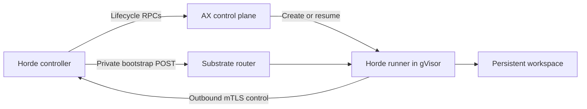

# Experimental AX runtimes

Horde can run workers through [Google AX](https://github.com/google/ax). Horde
still owns projects, repositories, workflows, and model accounts. AX creates one
Task for each project-bound worker and runs it on Agent Substrate with gVisor.

This backend targets a trusted fleet. AX and Substrate are early projects whose
APIs can change. Keep their API and router on your private management network;
Horde uses the existing fleet enrollment and account mechanisms.



## Prepare AX and the runner image

Use these upstream base revisions:

| Component | Revision |
| --- | --- |
| AX | `d8ed0fe38bceb7842d3c47817d53d16ccdfcb601` |
| Agent Substrate | `672533541dbf`, as selected by AX's `go.mod` |

The stock configuration supports ordinary Horde workers. Optional nested Docker
uses the [AX base-template patch](../containers/ax/patches/README.md) and a
separately configured gVisor sandbox, described below. Agent Substrate's source
remains unchanged.

Follow the pinned [Substrate development setup](https://github.com/agent-substrate/substrate/tree/672533541dbf#quickstart-development)
to create a kind cluster and install its services. Then deploy the pinned
[AX control plane](https://github.com/google/ax/tree/d8ed0fe38bceb7842d3c47817d53d16ccdfcb601#quick-start)
against that Substrate installation. Retain the image digests produced by the
builds in your deployment configuration. Horde does not install or scale the
cluster for you.

Configure Redis with persistent storage and append-only file (AOF) persistence
before starting the AX controller. The upstream development Redis manifest has
neither, so it cannot preserve AX metadata across host stop/start reliably.
Retain Substrate's PostgreSQL and object-store volumes as well. Existing workspace
snapshots do not restore lost AX Task metadata.

`ax_revision` checks that the profile selects Horde's supported revision. AX has
no version RPC, so verify the deployed control-plane images against your recorded
digests when installing or upgrading it. For a patched controller, record the
patch checksum alongside its image digest; `ax_revision` remains the upstream
base commit.

Build the Horde runner from the repository root after placing a Linux AMD64
Horde executable at `dist/amd64/horde`:

```sh
docker build --platform linux/amd64 -f containers/ax/Dockerfile \
  -t REGISTRY/horde-ax:experimental .
docker push REGISTRY/horde-ax:experimental
docker inspect --format '{{index .RepoDigests 0}}' REGISTRY/horde-ax:experimental
```

Replace `REGISTRY` with a registry your Substrate workers can reach. Use the
resulting `image@sha256:...` reference in the Horde profile. The image includes
Git, Docker/Compose and Buildx tools, and pinned Codex and Claude CLIs. For tests with mocked
providers, build with `--build-arg INSTALL_HARNESSES=false` to omit those CLIs.

The runner prepares `/workspace/.horde` for Horde's database, configuration,
caches, and home directory. It receives Horde's enrollment packet through a
private HTTP POST after AX starts the Task. Credentials never appear in the AX
Task specification. An identical bootstrap retry succeeds; a different packet
for an existing workspace fails. Existing state and identity survive resume.
AX workspace goals and debug execution are disabled; Horde prepares repositories
and runs the workflows.

The runner starts `tini`, then a Python supervisor, then Horde. The init process
reaps orphaned descendants, and the supervisor restarts Horde after a nonzero
exit while retaining its persistent workspace. Horde's recovery rules still
govern interrupted attempts.

## Configure a project runtime

First configure the controller's [enrollment signer and reachable address](runtime-management.md#enrollment-and-outbound-control).
Make the AX gRPC API and Substrate HTTP router reachable through private tunnels
bound to the controller's loopback interface. Add a profile to
`~/.config/horde/runtimes.toml`:

```toml
[profiles.ax-worker]
provider = "ax"
project = "PROJECT_UUID"
endpoint = "http://127.0.0.1:9090"
ax_router_endpoint = "http://127.0.0.1:8001"
ax_revision = "d8ed0fe38bceb7842d3c47817d53d16ccdfcb601"
image = "REGISTRY/horde-ax@sha256:IMAGE_SHA256"
ax_egress = ["*:443"]
cpus = 2
memory_mb = 4096
concurrency = 2
executor_roles = ["planner", "worker", "reviewer"]
```

Replace the project UUID, endpoints, registry, and digest. The example ports are
local tunnel endpoints, not Horde listener ports. Each project needs its own
profile. AX profiles connect directly to the API and do not use the `host` field.
Horde uses the AX atespace `horde-PROJECT_UUID` and records the resource identities
before provisioning.

`ax_egress` contains `host:port` entries for AX's Gateway, but the pinned upstream
does not enforce the port field. Its default, `*:443`, therefore allows all
outbound traffic. Use hostnames or CIDRs to limit destinations; a literal IP
needs a CIDR suffix such as `/32`. Horde adds the controller's address
automatically. Configure model accounts through Horde, and leave ambient model
credentials out of AX's control plane and runner configuration.

`executor_roles` selects the configured roles included in enrollment. The example
expects those roles to exist in the project's controller configuration. Managed
account profiles use Horde's existing account delivery path, including supported
subscription profiles. Roles without managed accounts must use API, Tuara, or
simulated authentication; ambient subscription logins are not copied. An empty
list does not configure worker executors.

The `cpus` and `memory_mb` values are sent to AX. This experimental integration
does not establish that upstream enforces per-Task limits. Configure Substrate
worker capacity for your workload and use Horde's concurrency limits to control
how much work it dispatches. `disk_gb` does not allocate an AX disk quota.

## Optional nested Docker

Nested Docker needs a different guest configuration from the stock AX template.
The [packaged AX patch](../containers/ax/patches/README.md) lets a custom runner
inherit the selected base template's guest `SecurityContext` and gVisor
`SandboxConfig`. It adds no capabilities by itself and leaves the stock setup
available for workers that do not need Docker.

Apply the patch to its recorded upstream revision, run its tests, and build and
pin the resulting AX controller image. Create a separate base ActorTemplate and
select it with the controller's `--template` and `--template-atespace` arguments.
Configure that template's `guest` container with the capabilities required by
[Docker inside gVisor](https://gvisor.dev/docs/tutorials/docker-in-gvisor/).
These capabilities apply inside the sandbox. Use the following fields in the
Substrate ActorTemplate JSON, preserving its other required settings:

```json
{
  "containers": [{
    "name": "guest",
    "securityContext": {
      "capabilities": {
        "drop": ["ALL"],
        "add": ["CHOWN", "DAC_OVERRIDE", "FOWNER", "FSETID", "KILL",
                "SETGID", "SETUID", "SETPCAP", "NET_BIND_SERVICE",
                "NET_ADMIN", "NET_RAW", "SYS_CHROOT", "SYS_PTRACE",
                "SYS_ADMIN", "MKNOD", "AUDIT_WRITE", "SETFCAP"]
      }
    }
  }],
  "sandboxConfig": {
    "sandboxClass": "SANDBOX_CLASS_GVISOR",
    "configName": "horde-docker"
  }
}
```

Create a separate Kubernetes `SandboxConfig` named `horde-docker`, with
`spec.sandboxClass: gvisor`, a pinned pause image, and a checksummed gVisor asset.
The upstream configuration has no runtime-argument field. Horde's
[runsc wrapper](../containers/ax/runsc-wrapper/main.go) supplies
`--net-raw=true --allow-packet-socket-write=true`, then executes the unchanged
upstream binary named `runsc.real` beside it.

To package the AMD64 asset, use a Linux build host with Go 1.26.1, GNU tar, and
zstd. Download the pinned release from the upstream
[gVisor SandboxConfig](https://github.com/agent-substrate/substrate/blob/672533541dbfcd29084e4de2475267088bda3651/manifests/ate-install/sandboxconfig-gvisor.yaml)
and verify its SHA-256 before extraction. From the Horde repository root:

```sh
AX_GVISOR_ARCHIVE=/absolute/path/to/verified/gvisor.tar.zstd
AX_GVISOR_STAGE="$(mktemp -d)"
tar --zstd -xf "$AX_GVISOR_ARCHIVE" -C "$AX_GVISOR_STAGE"
mv "$AX_GVISOR_STAGE/runsc" "$AX_GVISOR_STAGE/runsc.real"
(
  cd containers/ax/runsc-wrapper
  go test ./...
  CGO_ENABLED=0 GOOS=linux GOARCH=amd64 go build \
    -buildvcs=false -trimpath -ldflags='-s -w -buildid=' \
    -o "$AX_GVISOR_STAGE/runsc" .
)
tar -C "$AX_GVISOR_STAGE" -czf gvisor-horde-docker.tar.gz \
  runsc runsc.real gvisor-bin containerd-shim-runsc-v1
sha256sum gvisor-horde-docker.tar.gz
```

Keep `runsc.real`, `gvisor-bin`, and `containerd-shim-runsc-v1` byte-identical to the
upstream release. Publish the resulting archive where Substrate can fetch it, then set
`spec.assets.amd64.gvisor.url` and `sha256` to that archive's location and hash.
Record both the upstream archive hash and your new bundle hash. Substrate and
gVisor require no source patches.

Build the runner with `--build-arg ENABLE_DOCKER=true` in the earlier Docker build
command. The default is `false`; enabling it sets `HORDE_AX_DOCKER=true` in the
image. Push and pin this new image digest in its Horde profile.

After enrollment bootstrap arrives, the runner prepares guest cgroups and
networking, then starts Docker asynchronously. It uses `vfs`, the `cgroupfs`
driver, and `containerd-snapshotter=false`. Docker's firewall handling is disabled;
the runner configures TCP/UDP source NAT with `iptables-legacy` inside the guest
and matches the parent interface's MTU. Ordinary Docker and Compose commands use
the guest-owned `/var/run/docker.sock`; no host Docker socket is mounted.

Docker stores images, caches, and volumes in `/workspace/.horde/docker/data`.
Its transient execution state lives in `/run/horde-docker`, and diagnostics are
written to `/workspace/.horde/docker/dockerd.log`. Preparation is bounded. If it
fails or the daemon later exits, Horde remains reachable for inspection, draining,
and work that does not require Docker. Capability probes report the actual daemon
state. Docker is not restarted automatically; explicitly stop and start the
runtime to retry preparation without replaying uncertain workflow attempts.

Create a new Horde runtime after changing the base template or its sandbox
configuration. Existing derived AX templates are retained and are not updated
in place. Template preparation errors fail the AX Task rather than starting it
with a fallback template.

## Create and use workers

```sh
horde --project PROJECT runtime create ax-1 --profile ax-worker --request-id create-ax-1
horde --project PROJECT runtime inspect ax-1
horde --project PROJECT runtime list
horde --project PROJECT call runtime_capabilities '{}'
horde --project PROJECT submit --on ax-1 --repo /path/to/repo "Run the tests"
```

An AX Task becoming ready only confirms that its runner is available. Horde waits
for the worker's authenticated control connection before dispatching work.
Capability inventory reports `gvisor` isolation. It does not satisfy a project's
`vm` requirement. The submitted repository must be clean, with the source changes
you want to send committed.

For an AX-only fleet, select its workers through `--on`, or use the existing
[execution selection interface](delegation.md#let-your-agent-arrange-the-work)
with `requirements.isolation = "gvisor"` and an allowed pool containing your AX
workers. Selected remote work remains queued while its worker is offline;
disconnects do not move it to a local runtime or replay uncertain work.

Docker and Compose are advertised only when their probes succeed. Installing the
tools in the image does not supply a running Docker daemon, and the runner does
not mount a host Docker socket. Tasks requiring Docker or Compose need a worker
that reports those capabilities. Execution requirements accept `docker = true`
and `compose = true` to select such workers.

## Stop, resume, and recover

```sh
horde --project PROJECT runtime stop ax-1 --request-id stop-ax-1
horde --project PROJECT runtime start ax-1 --request-id start-ax-1
horde --project PROJECT runtime inspect ax-1
horde --project PROJECT runtime reconcile ax-1 --resource AX_RESOURCE_NAME --request-id reconcile-ax-1
horde --project PROJECT runtime destroy ax-1 --request-id destroy-ax-1
```

Use the resource name from inspection when reconciling. Repeat a request ID only
with the same arguments. Stop drains Horde work before suspending the AX Task;
start resumes the saved worker and waits for authenticated readiness. Suspension
is intended for idle workers, not as a way to pause active model calls.

Lost replies and unavailable services leave operations waiting or uncertain.
Inspect the AX Task and Horde operation before reconciling the recorded resource.
An absent AX Task remains uncertain during reconciliation; it does not cause a
replacement worker to be created.
Destroy waits for the actor to disappear before deleting its Gateway and
Workspace. Destroy is permanent cleanup; use stop to retain a warm worker.

AX workers use the profile's pinned image. Horde rejects runtime binary updates
for these workers before queuing an update. To upgrade, create a new profile and
runtime with the new image digest, drain the old worker, and direct new work to
the replacement. Retain the old worker until its work and state have been
inspected; Horde does not replace AX images automatically.

Requests through Substrate's router can wake a suspended actor. Use Horde or
AX control-plane inspection when you want to check a stopped worker without
waking it. Back up the deployment's persistent stores before replacing the
cluster; stopping a worker does not make its state independent of Substrate's
storage.

Drain and suspend project workers before stopping a kind cluster's host. After
the host restarts, retained Pods can receive new IPs while Substrate retains
their old worker addresses. In the tested recovery, replacing the idle WorkerPool
Pods through Kubernetes registered current addresses while preserving the AX
Tasks, Workspaces, and snapshots. Use this recovery when those addresses differ,
and require authenticated Horde readiness before dispatching work. AX API health
or a Task's ready status alone does not confirm that its worker is reachable.

## Validation and current limits

The pinned AX/gVisor deployment ran two projects concurrently and completed four
workflows, with two repositories and distinct account credentials per project. Eight
synthetic model calls overlapped across the projects; no live model providers
were called. Stop/start preserved all four workflows' files and task records,
along with worker certificate identities. Submissions using `--on` while workers
were offline stayed queued without local execution.

Killing and restarting the controller with four active remote account
reservations preserved the original task, request, account, and attempt bindings;
all four workflows finished without repeating a model call. Repeating each
worker's create request twice retained one operation per worker.
An explicit Horde runtime restart also completed through the supervisor and
restored authenticated readiness.

The Docker-enabled runner completed the same four-workflow, two-project scenario
with eight overlapping synthetic model calls. In both projects, ordinary Docker
builds executed `RUN` instructions and reached an HTTP service over bridge
networking. `docker compose up --build` also executed BuildKit `RUN` instructions;
two services communicated through Compose DNS. Project-specific image markers
and different digests remained separate, and each project's Docker daemon could
not find the other project's test image.

Terminating the managed Docker daemon left Horde authenticated and reachable.
After the capability cache refreshed, Docker and Compose both reported
unavailable, and a later check confirmed that the daemon had not restarted.
Explicit runtime stop/start restored Docker and Compose on both workers. Each
worker retained its original image digest and project marker; neither worker
could access the other project's cached image.

With the stock AX template, nested Docker 29.1.3 startup and Docker/Compose
commands failed, so workers correctly reported both capabilities unavailable.
The unpatched [AX actor template](https://github.com/google/ax/blob/d8ed0fe38bceb7842d3c47817d53d16ccdfcb601/internal/substrate/client.go#L213)
receives [Substrate's minimal guest capabilities](https://github.com/agent-substrate/substrate/blob/672533541dbfcd29084e4de2475267088bda3651/cmd/atelet/oci.go#L45).
The optional configuration above supplies the guest capabilities and runtime
flags required for [Docker inside gVisor](https://gvisor.dev/docs/tutorials/docker-in-gvisor/).
Published container ports (`-p`) have not been validated.
