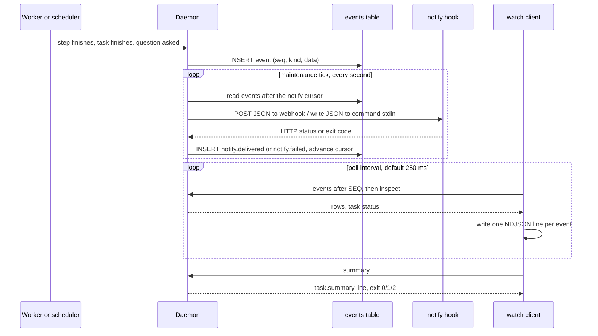

# Progress and notifications

Horde records every task milestone as a durable row in the daemon's `events`
table. Three surfaces read that table so an operator, a script, or any agent
toolkit can follow a task without polling `inspect` or depending on a particular
chat pane:

- `horde watch TASK_ID` streams the events as NDJSON until the task ends and
  exits by outcome. `horde events TASK_ID --follow` is the same command.
- `horde summary TASK_ID` prints one JSON object with the status, step
  outcomes, integrated head, and delivery outcome.
- A `[notify]` table in the configuration tells the daemon to POST each
  milestone to a webhook, pipe it into a local command, or both.



## `horde watch`

```sh
horde watch TASK_ID
horde events TASK_ID --follow      # identical
```

Each line on stdout is one complete JSON object. Stored events carry four keys:

```json
{"seq":42,"kind":"step.finished","created":1757404800,"data":{"step":"...","attempt":"...","state":"succeeded","result":{"accepted":true,"result":"..."},"timing":{}}}
```

`seq` is the row number in the daemon's events table, which counts up across
every task, so it is unique, always increasing within a task, and the cursor for
`--after`. `created` is a Unix timestamp in seconds. `kind` is the event name as
recorded by the daemon. `data` is the event payload parsed into JSON; a payload
that fails to parse is passed through as a string rather than dropped.

The command adds three line kinds of its own, without `seq` or `created`:

| kind | When | data |
| --- | --- | --- |
| `watch.status` | The task enters `waiting` or `blocked`, once per change. | `{"status":"waiting","questions":[{"id":"...","question":"..."}]}` |
| `watch.error` | The watch gave up before the task ended. | `{"error":"timeout","timeout_secs":N}` or `{"error":"daemon unavailable","detail":"..."}` |
| `task.summary` | Always the last line when the task reached a terminal status. | The same object `horde summary` prints. |

Exit status reports the outcome so a shell script can branch without parsing:

| Exit | Meaning |
| --- | --- |
| 0 | Task status `succeeded`. |
| 1 | Task status `failed`. |
| 2 | Task status `cancelled`. |
| 3 | `--timeout-secs` elapsed before the task ended. |
| 4 | The daemon socket disappeared while watching. |

Options:

| Flag | Default | Effect |
| --- | --- | --- |
| `--after SEQ` | 0 | Start after this sequence number. Use the last `seq` you saw to resume a stream without repeats. |
| `--interval-ms N` | 250 | Poll interval while the task is still running. |
| `--timeout-secs N` | none | Give up with exit 3 after this long, writing a `watch.error` line first. |
| `--summary auto\|text\|json` | auto | Also print a short human summary on stderr. `auto` prints it only when stderr is a terminal; `json` never prints it. |

The human summary on stderr lists the task and status, one line per step with
its state and whether it was accepted, the branch and integrated head, and the
delivery line. Stdout stays pure NDJSON in every mode.

Without `--follow`, `horde events TASK_ID` prints the current page of stored
events as one JSON array and exits, as before. `--after` applies there too.

## `horde summary`

```sh
horde summary TASK_ID
```

The output is a JSON object. It is also the `data` of the final `task.summary`
line from `horde watch`, and it is embedded as `summary` in `task.finished`
notifications.

```json
{
  "task": "ec0b38a0-...",
  "objective": "Add CSV export with tests",
  "repo": "/path/to/repository",
  "status": "succeeded",
  "terminal": true,
  "branch": "horde/ec0b38a0-...",
  "integrated_head": "f77164f504c2c19fc4e431a5c3cccc1ef74d6ee6",
  "questions_pending": 0,
  "steps": [
    {"name": "plan", "kind": "planner", "state": "succeeded", "attempts": 1, "accepted": true, "result": "...", "error": null},
    {"name": "implement", "kind": "command", "state": "succeeded", "attempts": 1, "accepted": true, "result": "...", "error": null},
    {"name": "deliver", "kind": "delivery", "state": "succeeded", "attempts": 1, "accepted": true, "result": "https://github.com/owner/repo/pull/12", "error": null}
  ],
  "delivery": {"outcome": "pr_ready", "pr_url": "https://github.com/owner/repo/pull/12", "reason": null}
}
```

`terminal` is true for `succeeded`, `failed`, and `cancelled`. `integrated_head`
is the HEAD of the task's integrated worktree when it still exists, otherwise
the commit of the last successful integration, or null when nothing was
integrated. Each step's `result` is the first 400 characters of the step's
reported result.

`delivery.outcome` is one of:

| outcome | Meaning | Other fields |
| --- | --- | --- |
| `pr_ready` | The delivery step pushed the branch and a PR is open and checked; `merge = false` stopped there. | `pr_url` |
| `merged` | The PR was merged. | `pr_url` |
| `pending` | The delivery step has not finished yet. | none |
| `failed` | The delivery step failed or was cancelled. | `reason` |
| `skipped` | No delivery ran. | `reason`, and a top-level `delivery_skipped` with the same text |

The `skipped` reasons are `template has no delivery step`, `delivery disabled in
settings ([delivery] enabled = false)`, `template has no delivery step; delivery
disabled in settings` when both apply, and `upstream step failed: NAME` when the
delivery step was skipped because an earlier step failed. Scripts that only want
to know whether to look for a PR can test for the presence of
`delivery_skipped`.

## `[notify]` hooks

Add a `[notify]` table to `config.toml` or to a repository's `.horde.toml`. The
daemon delivers milestones for any task whose pinned settings include at least
one target.

```toml
[notify]
webhook = "https://example.invalid/horde"        # POST JSON here
webhook_env = "HORDE_WEBHOOK_URL"                # or name a variable holding the URL
command = ["/bin/sh", "-c", "cat >> horde-notify.log"]
events = ["step.finished", "task.finished", "question.asked"]
timeout_seconds = 15
children = false
```

| Key | Default | Meaning |
| --- | --- | --- |
| `webhook` | unset | URL that receives an HTTP POST with the JSON payload as the body. |
| `webhook_env` | unset | Name of a variable holding the URL, read from the daemon environment or `credentials.env` at send time, so a URL that carries a secret never lands in a task's settings snapshot. `webhook` wins when both are set. |
| `command` | `[]` | Program and arguments run from the task's repository. The payload arrives on stdin as one JSON line. `HORDE_TASK`, `HORDE_HOOK`, and `HORDE_EVENT` are set. Stdout is discarded; stderr is kept for the failure record. |
| `events` | `["step.finished", "task.finished", "question.asked"]` | Hooks to deliver. `task.blocked` is the fourth option. Any other name is rejected at load. |
| `timeout_seconds` | 15 | Limit for one webhook request or one command run. Must be positive. A command that overruns is killed. |
| `children` | false | Also deliver for delegated child tasks. By default only tasks without a parent notify. |

Both `webhook` and `command` may be set, in which case every event goes to both.
An empty `webhook`, an empty `webhook_env`, or a `command` whose first element is
empty is rejected at load. Because settings are pinned at submission, editing
`[notify]` affects tasks submitted afterwards.

### Hooks and the events behind them

| Hook | Fires on stored event | Notes |
| --- | --- | --- |
| `step.finished` | `step.finished` | Every step attempt that ends, succeeded or failed. |
| `task.finished` | `task.finished`, `task.cancelled` | The payload's `event` field tells the two apart, and `summary` is attached. |
| `question.asked` | `question.pending` | A worker asked a question that needs an answer. For a child task the event is recorded on the parent that must answer it. |
| `task.blocked` | `task.blocked` | The task needs reconciliation, for example after a crash or a repeated tool call loop. Off by default. |

### Payload

The webhook body and the command's stdin line are the same object:

| Key | Meaning |
| --- | --- |
| `hook` | Which hook fired, one of the four names above. |
| `task` | Task id. |
| `seq` | Sequence number of the stored event. Together with `task` this identifies a delivery. |
| `created` | Unix timestamp of the stored event. |
| `event` | The stored event kind, for example `task.cancelled` under the `task.finished` hook. |
| `data` | The stored event's payload. |
| `objective` | The task's objective text. |
| `status` | The task's status at delivery time. |
| `summary` | Only on `task.finished`. The `horde summary` object, or null with a `summary_error` string if it could not be built. |

A `step.finished` delivery:

```json
{
  "hook": "step.finished",
  "task": "ec0b38a0-...",
  "seq": 42,
  "created": 1757404800,
  "event": "step.finished",
  "data": {
    "step": "3b1d...",
    "attempt": "9e0c...",
    "state": "succeeded",
    "result": {"accepted": true, "result": "Implemented CSV export with tests.", "artifacts": ["src/export.rs"]},
    "timing": {"elapsed_s": 412, "idle_s": 3, "budget_s": 1800, "remaining_s": 1388}
  },
  "objective": "Add CSV export with tests",
  "status": "running"
}
```

A `task.finished` delivery:

```json
{
  "hook": "task.finished",
  "task": "ec0b38a0-...",
  "seq": 61,
  "created": 1757405300,
  "event": "task.finished",
  "data": {"status": "succeeded"},
  "objective": "Add CSV export with tests",
  "status": "succeeded",
  "summary": {
    "task": "ec0b38a0-...",
    "status": "succeeded",
    "terminal": true,
    "branch": "horde/ec0b38a0-...",
    "integrated_head": "f77164f504c2c19fc4e431a5c3cccc1ef74d6ee6",
    "questions_pending": 0,
    "steps": [{"name": "plan", "kind": "planner", "state": "succeeded", "attempts": 1, "accepted": true, "result": "...", "error": null}],
    "delivery": {"outcome": "skipped", "pr_url": null, "reason": "template has no delivery step"},
    "delivery_skipped": "template has no delivery step"
  }
}
```

### Delivery semantics

The daemon keeps a durable cursor per task in `event_receipts` under the
consumer name `notify`, and checks for events past it once per second from its
maintenance loop. Each event is attempted once per target, then the cursor
advances whether or not the attempt succeeded, so an unreachable endpoint never
stalls later notifications and a failed delivery is not retried. The cursor
survives restarts, so a restarted daemon resumes after the last event it
processed instead of replaying the task. The one window for a duplicate is a
crash between a delivery and the cursor write, which repeats that single event
on restart. Receivers that must not act twice can key on `task` plus `seq`.

Every attempt records its outcome back into the same events table:

| Event | data |
| --- | --- |
| `notify.delivered` | `{"hook":"step.finished","seq":42,"event":"step.finished","target":"webhook"}` |
| `notify.failed` | The same keys plus `"error"`, capped at 400 characters. |

`target` is `webhook` or `command`. A webhook succeeds on any 2xx response.
A command succeeds on exit 0; a non-zero exit records the status and trimmed
stderr. Webhook errors omit the URL so a secret from `webhook_env` does not
land in the log. These events never trigger a hook themselves, and `horde watch`
shows them inline, so one stream tells you both what happened and whether the
notification went out.

## Examples

Follow a task and print each step's state as it finishes, then the delivery
outcome. The exit status belongs to `horde watch`, so read it from `PIPESTATUS`
rather than `$?`, which would report `jq`:

```bash
horde watch "$TASK" --summary json \
  | jq -r 'select(.kind == "step.finished") | "\(.data.state)\t\(.data.step)",
           select(.kind == "task.summary") | "delivery: \(.data.delivery.outcome) \(.data.delivery.pr_url // .data.delivery_skipped)"'
case ${PIPESTATUS[0]} in
  0) echo succeeded ;;
  1) echo failed ;;
  2) echo cancelled ;;
  3) echo timed out ;;
  4) echo daemon gone ;;
esac
```

Resume a stream after a disconnect by passing the last `seq` you saw:

```sh
horde watch "$TASK" --after 42 --timeout-secs 3600
```

Receive webhooks with a few lines of Python and no other dependencies. Each
request body is one payload:

```python
from http.server import BaseHTTPRequestHandler, HTTPServer
import json

class Hook(BaseHTTPRequestHandler):
    def do_POST(self):
        body = self.rfile.read(int(self.headers["Content-Length"]))
        payload = json.loads(body)
        line = f'{payload["hook"]} {payload["task"]} seq={payload["seq"]}'
        if payload["hook"] == "task.finished":
            delivery = payload["summary"]["delivery"]
            line += f' {payload["status"]} delivery={delivery["outcome"]}'
            line += f' {delivery.get("pr_url") or delivery.get("reason")}'
        print(line, flush=True)
        self.send_response(204)
        self.end_headers()

HTTPServer(("127.0.0.1", 8787), Hook).serve_forever()
```

Point the daemon at it:

```toml
[notify]
webhook = "http://127.0.0.1:8787/horde"
```

The same payload reaches a local command on stdin, so a shell hook can do the
work without a server:

```toml
[notify]
command = ["/bin/sh", "-c", "jq -c '{hook, task, status, pr: .summary.delivery.pr_url}' >> \"$HOME/horde-notify.log\""]
events = ["task.finished", "question.asked"]
```
